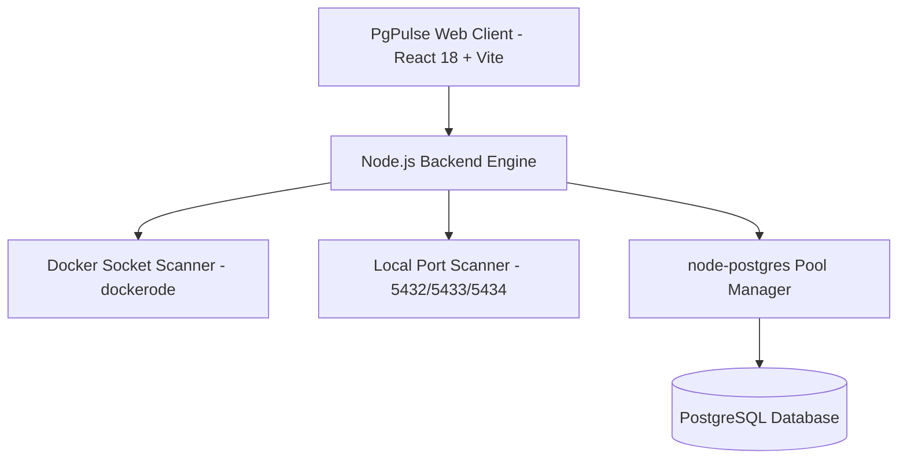

# ⚡ PgPulse — Modern PostgreSQL Studio, ERD Visualizer & Analytics Workbench

**PgPulse** is a state-of-the-art, open-source Web UI for visualizing, querying, and managing **PostgreSQL** environments. It features auto-discovery for local & Docker PostgreSQL instances, a Monaco-powered SQL editor, interactive ERD diagrams, live data analytics charting, user & privilege management, and built-in password recovery.


---

## ✨ Features

- 🔍 **Multi-Source Auto-Discovery**: Scans and detects running PostgreSQL Docker containers (via Docker Socket `/var/run/docker.sock`) and local system instances (`localhost:5432`, `5433`, `5434`) out of the box.
- 🔑 **Automated Password Reset**: 1-click system password reset for local or Docker instances via `sudo -u postgres psql` or `docker exec`, so you never get locked out by forgotten credentials.
- 💻 **Monaco SQL Studio**: Features full IntelliSense auto-completion for SQL keywords, table names, and column names, keyboard shortcuts (`Ctrl+Enter` to run), and instant export to CSV / JSON.
- 🗂️ **Database Selector & Schema Explorer**: Easily switch target databases (`postgres`, `ecommerce_db`, etc.) from the top navigation bar.
- 🕸️ **Interactive ERD Diagram**: Visualizes table relationships, primary keys, and foreign key constraints in interactive drag-and-drop node graphs powered by **React Flow**.
- 📊 **Analytics & Live Charting**: Instantly convert any SQL query output into interactive Bar, Line, Pie, or Area charts (powered by **Recharts**).
- 🛡️ **User, Role & Access Privilege Matrix**: Create/edit database users, change passwords, and manage database connection privileges (`GRANT` / `REVOKE`) through a visual matrix.
- 🐳 **Cross-Platform & Single Docker Container**: Runs seamlessly across **Linux**, **macOS**, and **Windows** with unified single-port deployment (`http://localhost:3001`).

---

## 🏗️ Architecture



---

## 🚀 Quick Start

### Option 1: Docker Compose (Recommended)

Run the entire application in a single isolated container with Docker Socket mounting:

```bash
docker compose up --build -d
```

Open your browser and navigate to:
**`http://localhost:3001`**

### Option 2: Local Development (Node.js)

#### Prerequisites
- Node.js 20+
- npm 9+

#### Steps
```bash
# 1. Clone the repository
git clone https://github.com/your-username/pgpulse.git
cd pgpulse

# 2. Install dependencies for backend and frontend
npm install --prefix backend
npm install --prefix frontend

# 3. Build production bundles
npm run build

# 4. Start the server
npm start
```

Access the Web UI at **`http://localhost:3001`**.

---

## 💡 Usage Highlights

### 1. Connecting to PostgreSQL Sources
When opening PgPulse, the **Select PostgreSQL Source** modal scans your environment:
- Select a **Docker Container** (e.g. `therapy_postgres`).
- Select a **Local System Instance** (e.g. `Localhost Postgres (Port 5432)`).
- Enter credentials (or use default `user: postgres`, `password: postgres`).

### 2. Emergency Sudo / Docker Password Reset
If you get `password authentication failed`:
- Click **"Quick Sudo Reset"** or **"Reset Pass"** on the card.
- Enter your Linux system `sudo` password and your new PostgreSQL password.
- PgPulse executes `sudo -u postgres psql` to update the password and automatically logs you in!

### 3. Switching Databases
Use the **`DB:`** dropdown in the top header bar to switch between available databases (`ecommerce_db`, `hospital_db`, `school_db`).

### 4. Plotting Live Charts in Analytics Studio
Navigate to the **Analytics** tab:
- Pick a sample preset query or write your own SQL query.
- Hit **`Run & Plot (Ctrl+Enter)`**.
- Customize Chart Type (Bar, Line, Area, Pie) and select X/Y axes.

---

## 📂 Project Structure

```text
.
├── docker-compose.yml        # Docker Compose configuration with Docker socket mount
├── Dockerfile                # Multi-stage production build Dockerfile
├── package.json              # Workspace root package definition
├── backend/
│   ├── src/
│   │   ├── index.ts          # Express server & static asset handler
│   │   ├── routes/api.ts     # REST API routes (discovery, query, schema, users)
│   │   ├── services/
│   │   │   ├── discovery.ts  # Docker socket & local port scanner
│   │   │   ├── postgres.ts   # Connection pooling & SQL execution
│   │   │   ├── schema.ts     # Schema inspection & ERD relationship extractor
│   │   │   └── userAdmin.ts  # User management & system password reset
├── frontend/
│   ├── src/
│   │   ├── components/       # Header, SqlStudio, SchemaBrowser, UserManagement, AnalyticsStudio
│   │   ├── services/api.ts   # API Client helper
│   │   └── App.tsx           # Main Application container
```

---

## 📜 License

Distributed under the **MIT License**. See `LICENSE` for more information.
